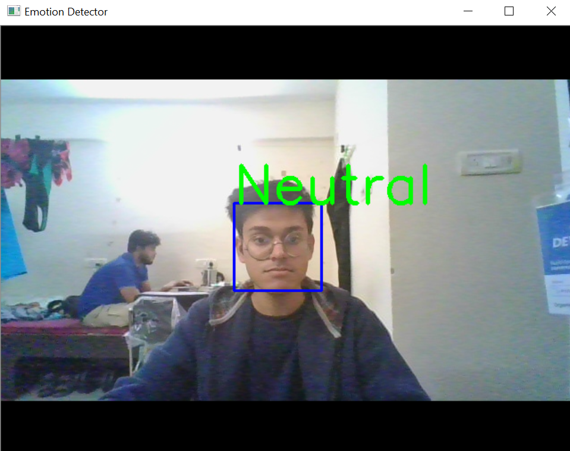
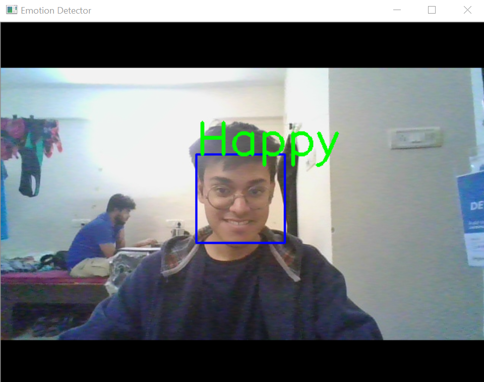
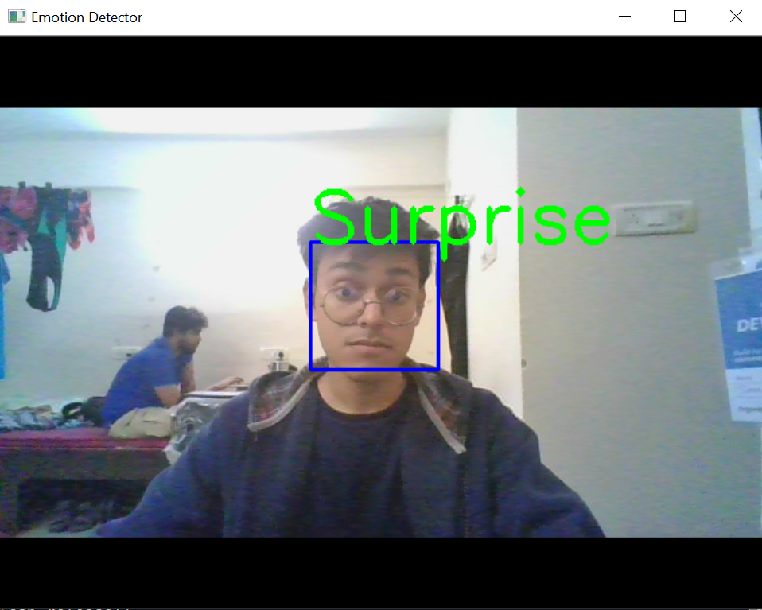
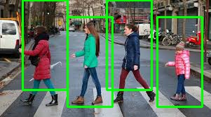
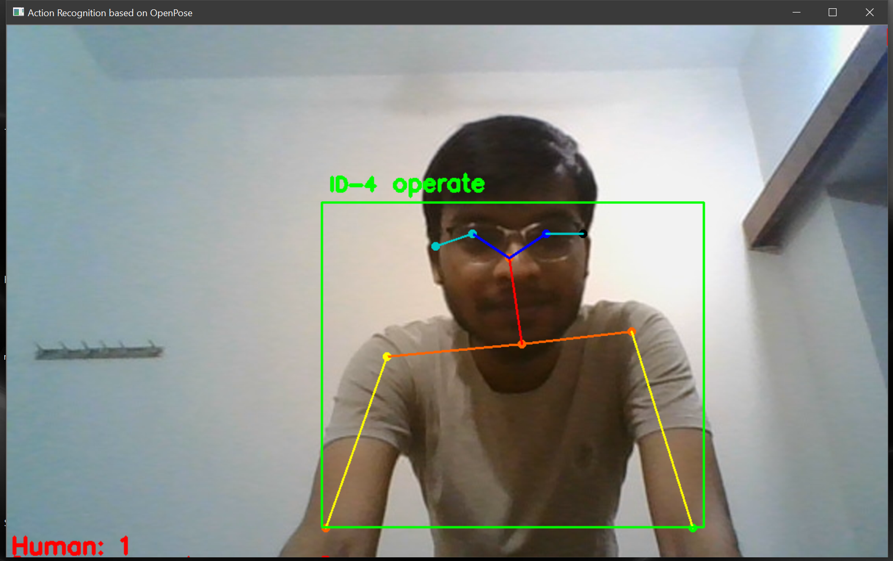
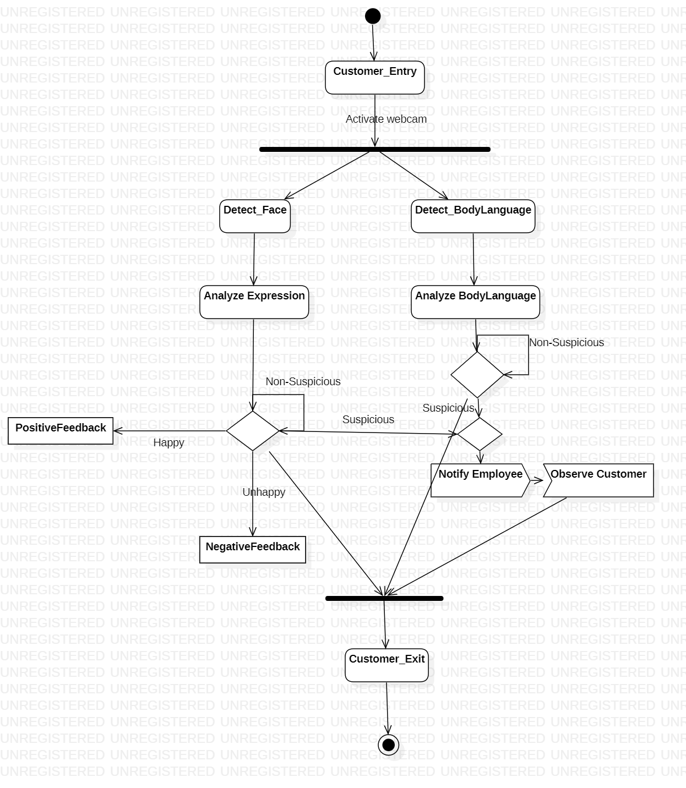

# Human Action Classifier And Pedestrian Detection

This algorithm could be used in any type of camera in a store which will help detect suspicious behaviour and alert the owner about theft.

# Dependencies

- Python >= 3.5
- Opencv == 4.2.0.32
- Tensorflow 2.0.0
- Scikit-learn 0.22.1
- Keras 2.3.1
- Numpy 1.18.1
- Sliding Window 0.0.13
- Scipy 1.4.1
- Pathlib 1.0.1

## Setting up a Virtual Environment

### Using Pip

[virtualenv](https://packaging.python.org/key_projects/#virtualenv) is used to manage Python packages for different projects. Using virtualenv allows you to avoid installing Python packages globally which could break system tools or other projects. You can install virtualenv using pip.

- **Installing a virtual environment**

  On macOS and Linux:

  ```bash
  python3 -m pip install --user virtualenv
  ```

  On Windows:

  ```cmd
  py -m pip install --user virtualenv
  ```

- **Creating a virtual environment**

  To create a virtual environment, go to your project’s directory and run venv. If you are using Python 2, replace `venv` with `virtualenv` in the below commands.

  On macOS and Linux:

  ```bash
  python3 -m venv <Your_Virtual_Environment>
  ```

  On Windows:

  ```cmd
  py -m venv <Your_Virtual_Environment>
  ```

- **Activating a virtual environment**

  Before you can start installing or using packages in your virtual environment you’ll need to activate it. Activating a virtual environment will put the virtual environment-specific python and pip executables into your shell’s `PATH`.

  On macOS and Linux:

  `source venv/bin/activate` _or_ `source <Your_Virtual_Environment>/bin/activate`

  On Windows:

  `.\venv\Scripts\activate` _or_ `.\<Your_Virtual_Environment>\Scripts\activate`

**To install the required packages, run `pip install -r requirements.txt`**

### Using Conda

- On Windows open the Start menu and open an Anaconda Command Prompt. On macOS or Linux open a terminal window. Use the default bash shell on macOS or Linux.

- Choose a name for your TensorFlow environment, such as “tensorflow-env”.

- Install the current release of CPU-only TensorFlow:
  ```cmd
  conda create -n <Your_Virtual_Environment> tensorflow
  conda activate <Your_Virtual_Environment>
  ```
  **To install the required packages, run `pip install requirements.txt`**

## Usage

Download the Resnet-32 Kinetic Model [here](https://drive.google.com/file/d/1raAySFB9lmu3h6X8a-DjBHEez4jWPDZT/view?usp=sharing), and place it under the corresponding folder( `human-activity-recognition/` )

- ### For Human Action Classification

  To start the webcam directly from your command prompt or PowerShell window, type `python human_activity_reco.py --model resnet-34_kinetics.onnx --classes action_recognition_kinetics.txt` after navigating to the `human-activity-recognition/` folder.
  
  You can choose to test on example video with command `python human_activity_reco.py --model resnet-34_kinetics.onnx --classes action_recognition_kinetics.txt --input example_activities.mp4`  

You can download the test video [here](https://drive.google.com/file/d/1SfoekxApT3gIBs_b4pXeDnDtNy6T8PIx/view?usp=sharing) and navigating to the `human-activity-recognition/` folder and paste it there.

- ### For Pedestrian Detection Using Non-Maximum-Suppression

  Navigate to `Pedestrian-Detection/` folder inside the main/root project directory and type `python detect.py --image images` from your command prompt.

- ### For Facial Emotion Recognition

  Navigate to `Emotion_Detection/` folder inside the main/root project directory and type `python emotion_detector.py` from your command prompt.
  
- ### For PoseNet - Pose Estimation

  Navigate to `posenet-py/` folder inside the main/root project directory and type `python webcam_demo.py` from your command prompt.
  
  If you want to test the application using a video follow steps provided below:
  1) Download the Test Video.
  2) Save the test video in 'posenet-py' folder.
  3) Navigate to `posenet-py/` folder inside the main/root project directory and type `python webcam_demo.py` from your command prompt.

## Component Breakdown

This application could be broken down into three categories -

- ### Emotion Detection

  It can detect human emotions of all the customers and give an automated overall happiness rating to the store. Some Screenshots of the live application can be found below.

    

- ### Pedestrian Detection

  <p align="center">
  

- ### Body Language Detection

  <p align="center">
    
  <p align="center">
      
  <p align="center">
      
  <p align="center">
      

## Activity Diagram



### Dataset Used

Haarcascades :- [Dataset](https://drive.google.com/open?id=1YmAJaR06jrQsIS5ixd3gMsKTL7JhLuVa)
Resnet :- [Dataset](https://drive.google.com/file/d/1raAySFB9lmu3h6X8a-DjBHEez4jWPDZT/view?usp=sharing)

_Download this and paste it at the root of the project_

## Others

Change the number of classes according to you.
Do Experiment with different pre-trained models.

Enjoy Deep Learning.
